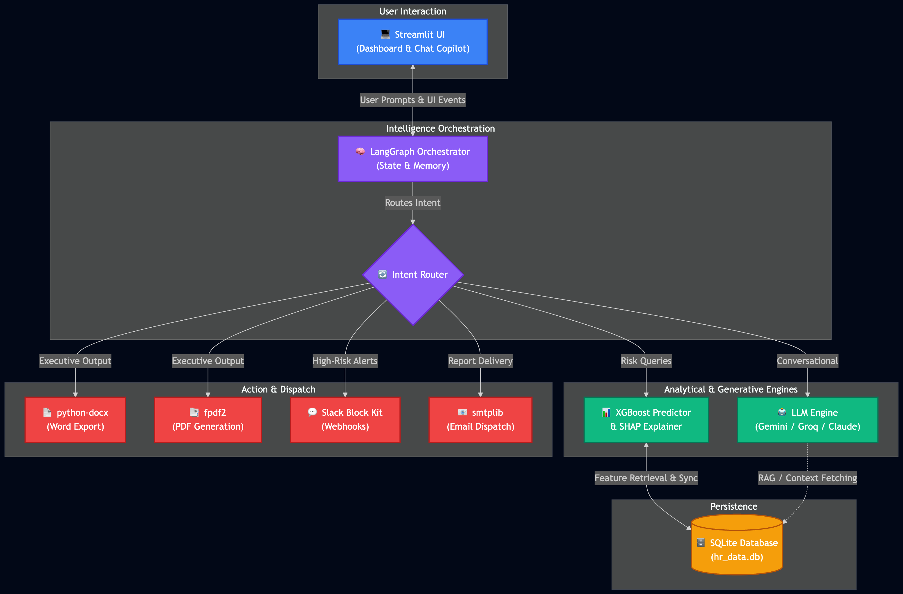

# PeopleRisk AI

## Problem Statement
Modern organizations face significant financial and operational losses due to unexpected employee attrition. Traditional HR dashboards provide retroactive data but fail to proactively predict flight risks, identify key drivers, or suggest actionable interventions. 

PeopleRisk AI solves this by transforming static HR data into an intelligent, multi-agent conversational platform that predicts attrition before it happens and autonomously generates targeted retention strategies. It represents a transition from static data dashboards to a dynamic, AI-driven conversational search interface powered by LangGraph, flexible LLMs (Google GenAI, Groq, Anthropic), and automated manager dispatch mechanisms.

---

## Team Members & Contributions
- **Daisy Augustine**: [Role/Contribution - ML Pipeline, XGBoost Modeling, & Data Generation]
- **Jenifer Deli**: [Role/Contribution - LangGraph Orchestration & Automation Workflows (PDF, Slack, Email)]
- **Sinto Joy**: [Role/Contribution - Streamlit UI, Theme & UX ]


---

## Agent Architecture & Module Design




The project is structured in a highly modular way under the `src/` directory to separate concerns and ensure maintainability.

### 1. `src/agents/` (AI & Orchestration)
Handles the conversational AI backend and state machine.
- **LangGraph Orchestrator**: Manages the conversational state, memory persistence, and flow.
- **Intent Router**: intercepts user queries and routes them dynamically (e.g., General Chat vs. Retention Document Generation).
- **Dynamic Provider Interface**: Abstracted LangChain bindings that dynamically switch between Gemini, Llama (via Groq), and Claude based on environment variables or UI configuration.

### 2. `src/models/` (Machine Learning Core)
Responsible for predicting employee flight risk.
- **XGBoost Classifier**: Trains on historical/synthetic HR data to predict the probability of attrition.
- **Metrics**: 89.5% Accuracy, 94.46% F1-Score, 98.9% Recall (optimized for capturing potential flight risks).

### 3. `src/analytics/` (Explainability)
Provides human-readable context to the ML predictions.
- **SHAP TreeExplainer**: Extracts the top 3 categorical drivers of attrition risk (e.g., Tenure, Salary, Monthly Hours) for each employee. These insights are synced back to the SQLite database.

### 4. `src/ui/` (Frontend & Interaction)
The client-facing interface built using **Streamlit**.
- **Dashboard Pane**: Renders metrics and high-risk employees in a standard data view.
- **Chat Copilot**: A sticky, ChatGPT-style chat panel featuring dynamic user/assistant rendering, seamless scrolling, and zero-click Groq auto-connection.
- **UI Components**: Uses CSS grid/flex layouts and custom styling to maintain a unified dark-mode enterprise aesthetic.

### 5. `src/automation/` (Action & Dispatch)
Executes real-world actions based on AI intents.
- **Document Generation**: Generates editable Word Documents using `python-docx`.
- **PDF & Email Dispatch**: Compiles executive summaries into PDFs using pure Python `fpdf2` and dispatches them via `smtplib`.
- **Slack Alerts**: Fires high-visibility Block Kit payloads via `requests` to corporate Slack channels.
- **Rules Engine**: Deterministic HR Rules Engine that identifies targeted interventions based on predictive model outputs.

### 6. `src/data/` & `src/storage/` (Persistence)
- Manages the local `SQLite` database (`hr_data.db`).
- Handles conversation persistence and state tracking across Streamlit sessions.

### 7. `src/config/` (Environment)
- Responsible for injecting environment variables from `.env`.
- Manages cross-module constants and feature flags.

---

## Tech Stack Summary

| Layer | Technologies | Versions (OSS) |
| :--- | :--- | :--- |
| **Language** | Python | `3.9+` |
| **Orchestration** | LangGraph, LangChain | `>=0.0.30`, `>=0.2.0` |
| **Machine Learning** | XGBoost, scikit-learn, SHAP | `>=2.0.0`, `>=1.3.0`, `>=0.43.0` |
| **Data Processing** | Pandas, NumPy, SQLite3 | `>=2.0.0`, `>=1.24.0` |
| **Frontend/UI** | Streamlit, Plotly, matplotlib | `>=1.28.0`, `>=5.18.0`, `>=3.8.0` |
| **Reporting & Actions** | python-docx, fpdf2, smtplib | `>=1.1.0`, `>=2.7.0` |

---

## Environment Setup & Installation

### 1. Python Virtual Environment
```bash
python3 -m venv .venv
source .venv/bin/activate
pip install -r requirements.txt
```

### 3. Environment Variables
Copy the provided `.env.example` file to create your local `.env`.
```bash
cp .env.example .env
```
Populate the API keys and SMTP credentials as needed. The platform can operate in a simulated mode if Slack/SMTP credentials are left blank.

---

## Sample Data Generation

If you need a mock dataset to test the platform without connecting to your production HRIS, a generation script is included in the adjacent `SampleData` directory.

To generate a new synthetic HR roster:
```bash
# Navigate to the SampleData directory
cd "../SampleData"

# Run the generator script
python generate_mock_hr_data.py
```
This script generates a highly realistic corporate HR dataset (`synthetic_hr_roster_1250.csv`) with 1,250 employee records. It includes intelligent heuristics (e.g., correlating high tenure and low salary with high attrition risk) and pre-calculates mock SHAP risk drivers to fully populate the dashboard and test the AI inference engine.

---

## Execution Workflow

### 1. Run the ML Pipeline
If the SQLite database (`hr_data.db`) is missing or needs regeneration, run the data foundation and training pipelines:
```bash
source .venv/bin/activate
python -m src.models.training
python -m src.analytics.explainability
```

### 2. Boot the Streamlit UI
Start the conversational frontend:
```bash
source .venv/bin/activate
PYTHONPATH=. python -m streamlit run src/ui/app.py
```

Once running, the AI Assistant will automatically initialize the LLM backend and anchor itself to the dashboard. You can access the "⚙️ Configuration" tab in the sidebar to hot-swap AI providers or manage automation credentials on the fly. You can also explore the new **Executive Summary** tab for AI-driven HR recommendations.
